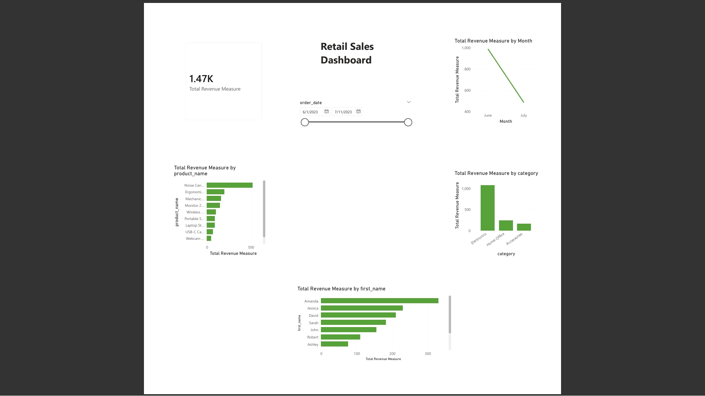

# 📊 Sales Forecasting Dashboard  
End‑to‑end retail sales analysis using **Python**, **SQL**, and **Power BI** to forecast sales trends.

## 🚀 Project Overview  
This project demonstrates a complete analytics workflow for understanding retail sales performance.  
It includes:

- SQL‑based data cleaning and analysis  
- A Python EDA notebook for deeper insights  
- An interactive Power BI dashboard for business reporting  

The goal is to help stakeholders understand revenue trends, product performance, and customer behavior using a clean, professional analytics pipeline.

---

## 🗂 Project Structure  
```
sales-forecasting-dashboard
│
├── data/                 # Raw datasets (customers, orders, products)
├── images/               # Visuals for README and documentation
├── notebooks/            # Python EDA notebook (.ipynb)
├── Powerbi/              # Power BI dashboard (.pbix)
├── Sql/                  # SQL scripts for cleaning and analysis
└── README.md
```

---

## 🧹 Data Cleaning (SQL)  
SQL scripts in the `Sql/` folder handle:

- Standardizing date formats  
- Removing duplicates  
- Fixing null values  
- Ensuring numeric fields are properly typed  
- Preparing tables for analysis and dashboarding  

These steps ensure the dataset is clean, consistent, and ready for analysis.

---

## 📈 Sales Analysis (SQL)  
Analysis queries include:

- Total revenue  
- Revenue by product  
- Revenue by category  
- Revenue by region  
- Monthly revenue trends  
- Top customers  
- Top products  

These insights help identify performance drivers and business opportunities.

---

## 🐍 Python Analysis Notebook  
Located at:

```
notebooks/sales_forecasting_analysis.ipynb
```

The notebook includes:

- Data loading and inspection  
- Merging customer, order, and product datasets  
- Revenue calculations  
- Monthly revenue trends  
- Category‑level insights  
- Top product performance  
- Findings summary  
- Conclusion and next steps  

This notebook supports the SQL analysis and Power BI dashboard, forming the analytical foundation of the project.

---

## 📊 Power BI Dashboard  

### Retail Sales Dashboard  


---

## 🐍 Python Notebook Output  
The full analysis is available in the notebook:

`notebooks/sales_forecasting_analysis.ipynb`

(No screenshot needed — the `.ipynb` file contains all outputs.)

---

## 📁 Dataset Description  
The project uses three core CSV files located in the `data/` folder:

- **customers.csv** — customer IDs, names, locations  
- **orders.csv** — order dates, quantities, product IDs, customer IDs  
- **products.csv** — product names, categories, and prices  

These files are merged in the Python notebook to calculate revenue and generate insights.

---

## 🛠 How to Run This Project

### 1. Clone the repository
```
git clone https://github.com/niyonzansabandi-ai/sales-forecasting-dashboard.git
cd sales-forecasting-dashboard
```

### 2. Run SQL scripts  
Open the `Sql/` folder and run any `.sql` script using SQLite, DBeaver, or VS Code SQL extensions.

### 3. Run the Python notebook  
Open:
```
notebooks/sales_forecasting_analysis.ipynb
```
Run it using Jupyter, VS Code, or any notebook environment.

### 4. Open the Power BI dashboard  
Located in:
```
Powerbi/retail_sales_dashboard.pbix
```
Requires **Power BI Desktop**.

---

## 🔮 Future Improvements  
- Add forecasting models (ARIMA, Prophet, ML regressors)  
- Automate SQL + Python data refresh  
- Expand dataset with additional months/years  
- Add advanced Power BI visuals  
- Build a fully automated analytics pipeline  

---

## 🧰 Tools Used  
- **Python** (Pandas, NumPy, Matplotlib)  
- **SQL** (SQLite)  
- **Power BI**  
- **VS Code**  
- **Git & GitHub**  

---

## 📬 Contact  
If you'd like to discuss this project or collaborate, feel free to reach out.
